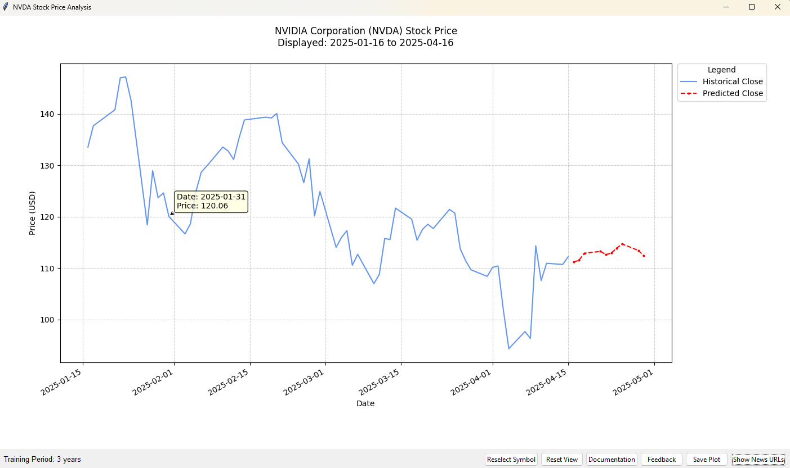

# Stock Analysis PC - LSTM & Sentiment Tool



## Description

Stock Analysis PC is a desktop application built with Python and Tkinter that allows users to:
*   Visualize historical stock price data fetched from Yahoo Finance.
*   Analyze technical indicators.
*   View future price predictions generated by an LSTM (Long Short-Term Memory) neural network model.
*   Incorporate news sentiment analysis (using GDELT, Newspaper3k, VADER) to potentially adjust predictions.
*   Interact with the plot.
*   Save the generated plot as an image.

This tool is intended for educational and informational purposes.

## Features

*   Fetches stock data using `yfinance`.
*   Calculates technical indicators (EMA, MACD, RSI, OBV, ATR, Bollinger Bands related).
*   Trains an LSTM model on historical data (user-defined period) to predict future closing prices (fixed 10-day forecast).
*   News sentiment fetching and analysis integration.
*   Linear regression forecasting for future sentiment trends.
*   Interactive Matplotlib plot embedded in a Tkinter GUI.
    *   Hover to see specific price/date details.
    *   Scroll wheel zooming.
    *   Toggle plot lines via legend click.
    *   Reset View button.
*   Option to save the plot to PNG, JPG, or PDF.
*   Bundled PDF documentation accessible from the application.
*   Feedback form link integrated.

## Prerequisites

**For Running the Executable (Windows Only):**
*   Windows 10/11 (or compatible Windows version).
*   Internet connection (for fetching stock data and news).
*   *(No Python installation needed)*

**For Running from Source Code (Windows, macOS, Linux):**
*   Python 3.8+ recommended.
*   Operating System: Windows, macOS, or Linux.
*   Required Python packages (see `requirements.txt`).
*   Internet connection.

## Installation & Running (Source Code)

1.  **Clone the repository:**
    ```bash
    git clone https://github.com/Desloo/Stock_Analyzer.git
    ```
2.  **Navigate into the directory:**
    ```bash
    cd Stock_Analyzer
    ```
3.  **(Recommended) Create and activate a virtual environment:**
    ```bash
    python -m venv venv
    # On Windows
    .\venv\Scripts\activate
    # On macOS/Linux
    source venv/bin/activate
    ```
4.  **Install dependencies:**
    ```bash
    pip install -r requirements.txt
    ```
    *(Note: TensorFlow installation might require specific steps depending on your system/GPU).*
5.  **Run the application:**
    ```bash
    python stock_apk.py
    ```

## Running the Executable (Windows)

Currently, a pre-built version is provided **only for Windows (64-bit)**. This executable is packaged within a `.zip` archive that contains all necessary files.

1.  **Navigate to Releases:** Go to the [Releases](https://github.com/Desloo/Stock_Analyzer/releases) page of this repository. 
2.  **Download the Archive:** Find the latest release and download the `.zip` file listed under "Assets" (e.g., `StockAnalysisPC-v1.0-Windows.zip`).
3.  **Extract the Archive:** Once downloaded, **extract the entire contents** of the `.zip` file to a new folder on your computer. Do **not** try to run the executable directly from within the zip file viewer.
4.  **Open the Extracted Folder:** Navigate into the folder created during extraction (it will likely be named `Stock Analyzer` or similar, matching the folder inside the zip).
5.  **Run the Application:** Inside this folder, find and double-click the executable file named `Stock Analyzer.exe` (or similar application name) to launch the program.

*(This executable is built for Windows and will **not** run on macOS or Linux. To run on other platforms, please follow the "Running from Source Code" instructions.)*

## Documentation

For detailed information on features, usage, and the model, please refer to the bundled documentation:
[Stock Analysis PC.pdf](./Stock%20Analysis%20PC.pdf)

Mathematical Model Breakdown:
[Model Details PDF](./stock_analyzer_model.pdf)

## Disclaimer

**This software is for educational and informational purposes ONLY. It does NOT constitute financial advice.** Stock market predictions are inherently uncertain. Past performance is not indicative of future results. Do not rely solely on this tool for making investment decisions. Use this software entirely at your own risk. The developers assume no responsibility for any financial losses incurred.

## License

This project is licensed under the MIT License - see the [LICENSE](./LICENSE) file for details. *(e.g., MIT License)*

## Feedback & Contact

*   Feedback is welcome! Please use the "Feedback" button within the application or open an issue on GitHub.
*   Check out the demo video on YouTube: https://youtu.be/c9qvytfMsK4
